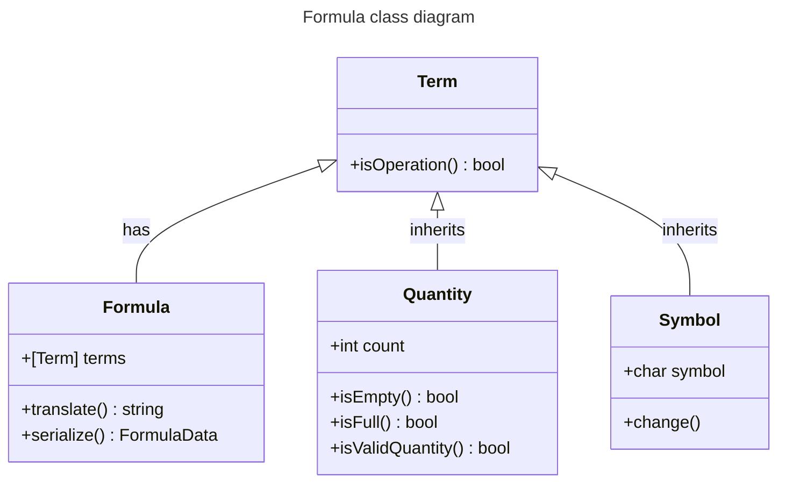

# :watermelon: Documentamelon
`Technical documentation for the Calculamelon App`
## :pear: Intro
**Calculamelon** is an application to learn math with a language without numbers or letters, just basic math symbols and fruits using an intuitive **playground** and a repository of **published formulas** managed by a **democratic community**.
## :tangerine: Features
### :lemon: Frontend
- **Gestures**: _Drag and drop_ to move fruits, _swipe_ to change symbols and _double tap_ to change the fruit.
- **Animations**: Not just for aesthetics, fruits and symbols move and scale properly acording to user interaction.
- **Responsiveness**: Adapted scale and margin to any screen for _web_, _mobile_ and _desktop_.
- **Tech hiding**: There is no text in the whole app, so no error messages, if a request fails, the associated button will not show on screen.
### :apple: Backend
- **Online formulas**: Published formulas to try to solve, not linked to an account, everything is _public_ and _anonymous_.
- **Democratic presence**: Formulas are ranked using a _voting system without account_. Liked formulas move up the list, disliked move down and 0 votes removes the formula.
- **Profiles**: 4 ways to use de App, as _Offline_ users only use the playground, _Students_ can see the list of formulas, _Citizens_ can vote and _Teachers_ can publish formulas.
## :wrench: Tools
- **Postgres** [database](#database) on _Supabase_.
- **Kotlin Multiplatform** application [develoment](#architecture) on _Android_, _Windows_ and _Web Assembly_.
- **Ktor** client library to make _HTTP_ requests to the _Supabase_ _REST API_.
- **Git** for version control and documentation on _GitHub_.
- **Kanban** for tracking tasks on _Trello_.
- **Figma** for icon design.
- **Carrd** for the landing [page](https://calculamelon.carrd.co/).


## :straight_ruler: Architecture


### Data
`Data classes` are used to use information stored in the database that is retrieved in `FormulaRepository`, an `interface` implemented as a mock list for testing and using _API requests_ to _Supabase_ API for production database, both mock and API are implemented as _singletons_.

`Device` class is used to get an **ID** for **voting** without user intervention the ID of the device _OS_ is retrieved, this is an `expect` class implemented differently in every platform except for the web, because it is not posible to get a consistent unique ID, so voting is not available.

#### Data classes
Note that **number of votes** is omitted because that is not displayed in the app.
```kotlin
data class FormulaData (val terms: String)
```
The complete version of vote data is used to _POST_ a vote, for updating and checking votes a there is a simplified version with just the `Boolean`.
```kotlin
data class VoteData (val formula: String, val user: String, val vote: Boolean)
```
#### Repository interface
```kotlin
/**
 * Returns a list of formulas, empty list if there are no formulas or an error occurs
 */
suspend fun load(start: Int = 0): List<FormulaData>
/**
 * Saves a formula, does not inform if an error occurs
 */
suspend fun save(formula: Formula)
/**
 * Returns true if the formula exists, false if it does not exist, null if error occurs
 */
suspend fun exists(formula: Formula): Boolean?
/**
 * Vote for a formula, user must be a unique string,
 * up is true for a positive vote, false for a negative
 * does not inform if an error occurs
 */
suspend fun vote(formula: Formula, user: String, up: Boolean, new: Boolean = true)
/**
 * Checks formulas vote for this user: 0 is no vote, -1 negative vote, 1 positive vote.
 * Returns null if error occurs
 */
suspend fun voted(formula: Formula, user: String): Int?
```
### Domain

### View
## :elephant: Scalability
## :floppy_disk: Database
- **Formulas** stores published formulas as text using the formula as the _primary key_ to prevent duplicates and number of votes is an integer to sort by popularity.
- **Votes** stores every vote, it is related to formulas by the formula text as a _foreign key_. A vote _primary key_ is a combination of the **formula** and the **user ID**, so one vote for user and formula is enforced. On the field **vote** _true_ means add up one vote, _false_ substract one vote.
### Schema


### Tables
```sql
CREATE TABLE public.formulas (
  terms text NOT NULL UNIQUE,
  votes bigint NOT NULL DEFAULT '1'::bigint,
  CONSTRAINT formulas_pkey PRIMARY KEY (terms)
);

CREATE TABLE public.votes (
  formula text NOT NULL,
  user text NOT NULL,
  vote boolean NOT NULL,
  CONSTRAINT votes_pkey PRIMARY KEY (formula, user),
  CONSTRAINT votes_formula_fkey FOREIGN KEY (formula) REFERENCES public.formulas(terms)
);
```
### Policies
- Enable public read for **Formulas** and **Votes** to _SELECT_ the list of formulas and check current voting status on one formula for one user.
- Allow _INSERT_ and _UPDATE_ to add or modify **votes**, with _primary key_ preventing **double voting**.
- On _INSERT_ a new **formula** the _primary key_ prevents duplicates and the policy **enforces** exactly **1 vote** on insertion to **avoid** a user **publishing** any number of **votes** for the formula.


```sql
-- Formulas table
alter policy "Enable read access for all users" on "public"."formulas" to public using (true);
alter policy "Prevent vote insertion" on "public"."formulas" to public with check ((votes = 1));

-- Votes table
alter policy "Enable read access for all users" on "public"."votes" to public using (true);
alter policy "Allow voting" on "public"."votes" to public with check (true);
alter policy "Allow vote modification" on "public"."votes" to public using (true);
```
### Triggers
When a vote is **inserted** or **updated** a **trigger** is used to update the **vote count** on the **formula table** for that formula.


```plpgsql
DECLARE
  vote integer := 0;
  count integer;
BEGIN
  IF TG_OP = 'UPDATE' AND NEW.vote = OLD.vote THEN
    RETURN NEW;
  ELSE
    IF NEW.vote THEN
      vote := 1;
    ELSE
      vote := -1;
    END IF;
    
    UPDATE public.formulas SET votes = votes + vote WHERE NEW.formula = public.formulas.terms;
    
    count := (SELECT formulas.votes FROM formulas WHERE formulas.terms = NEW.formula);

    IF count <= 0 THEN
      DELETE FROM public.formulas WHERE public.formulas.terms = NEW.formula;
    END IF;

  END IF;
  RETURN NEW;
END;
```
