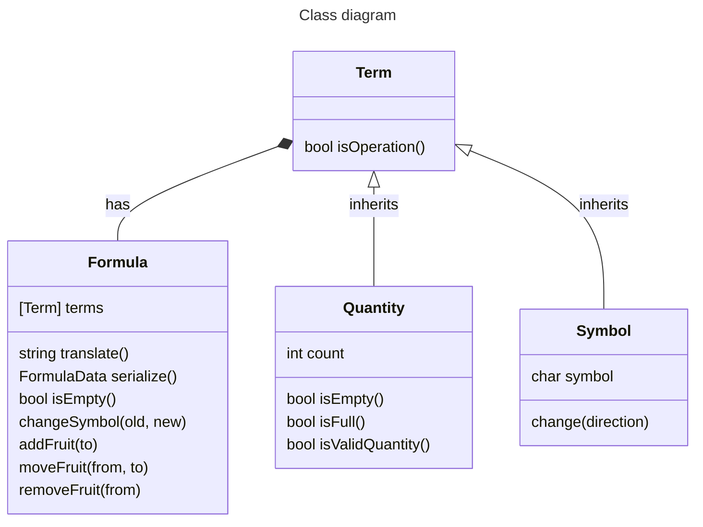

# 🍉 Documentamelon
`Technical documentation for the Calculamelon App`
## 🍐 Intro
**Calculamelon** is an application to learn math with a language without numbers or letters, just basic math symbols and fruits using an intuitive **playground** and a repository of **published formulas** managed by a **democratic community**.
## 🍊 Features
### 🍋 Frontend
- **Gestures**: _Drag and drop_ to move fruits, _swipe_ to change symbols and _double tap_ to change the fruit.
- **Animations**: Not just for aesthetics, fruits and symbols move and scale properly acording to user interaction.
- **Responsiveness**: Adapted scale and margin to any screen for _web_, _mobile_ and _desktop_.
- **Tech hiding**: There is no text in the whole app, so no error messages, if a request fails, the associated button will not show on screen.
### 🍎 Backend
- **Online formulas**: Published formulas to try to solve, not linked to an account, everything is _public_ and _anonymous_.
- **Democratic presence**: Formulas are ranked using a _voting system without account_. Liked formulas move up the list, disliked move down and 0 votes removes the formula.
- **Profiles**: 4 ways to use de App, as _Offline_ users only use the playground, _Students_ can see the list of formulas, _Citizens_ can vote and _Teachers_ can publish formulas.
## 🔧 Tools
- **Postgres** database on _Supabase_.
- **Kotlin Multiplatform** application develoment on _Android_, _Windows_ and _Web Assembly_.
- **Ktor** client library to make _HTTP_ requests to the _Supabase_ _REST API_.
- **Git** for version control and documentation on _GitHub_.
- **Kanban** for tracking tasks on _Trello_.
- **Figma** for icon design.
- **Carrd** for the landing [page](https://calculamelon.carrd.co/).


## 📏 Architecture


### 💿 Data
`Data classes` are used to use information stored in the database that is retrieved in `FormulaRepository`, an `interface` implemented as a mock list for testing and using _API requests_ to _Supabase_ API for production database, both mock and API are implemented as _singletons_.

`Device` class is used to get an **ID** for **voting** without user intervention the ID of the device _OS_ is retrieved, this is an `expect` class implemented differently in every platform except for the web, because it is not posible to get a consistent unique ID, so voting is not available.

#### Data classes
Note that **number of votes** is omitted because that is not displayed in the app.
```kotlin
data class FormulaData (val terms: String)
```
The complete version of vote data is used to _POST_ a vote, for updating and checking votes a there is a simplified version with just the `Boolean`.
```kotlin
data class VoteData (val formula: String, val user: String, val vote: Boolean)
```
#### Repository interface
Note that _KDoc_ is user for commenting functions without **annotations**, this is deliverate, not to add unnecessary noise to the explanations.
```kotlin
/**
 * Returns a list of formulas a number of formulas up to a determied page size starting from a given index,
 * empty list if there are no formulas or an error occurs
 */
suspend fun load(start: Int = 0): List<FormulaData>
/**
 * Saves a formula, does not inform if an error occurs
 */
suspend fun save(formula: Formula)
/**
 * Returns true if the formula exists, false if it does not exist, null if error occurs
 */
suspend fun exists(formula: Formula): Boolean?
/**
 * Vote for a formula, user must be a unique string,
 * up is true for a positive vote, false for a negative
 * does not inform if an error occurs
 */
suspend fun vote(formula: Formula, user: String, up: Boolean, new: Boolean = true)
/**
 * Checks formulas vote for this user: 0 is no vote, -1 negative vote, 1 positive vote.
 * Returns null if error occurs
 */
suspend fun voted(formula: Formula, user: String): Int?
```
### 🚥 Domain
The main component of this application business logic is the `Formula`, it has a list of `Term` that can be a `Quantity` or a `Symbol`.


Here is a _simplified class diagram_ to illustrate the fundamental relations and caracteristics of this 4 components.

Here is the **code** of the actual classes with just the function headers and comments:
#### Term
```kotlin
/**
 * An abstract class in a list that represent a formula. It can be a Quantity or a Symbol.
 */
abstract class Term {
    /**
     * Returns true if the term is an operation symbol (+, -, *, /), false otherwise
     */
    fun isOperation(): Boolean
}
```
#### Quantity
```kotlin
/**
 * A quantity is a number between a range.
 * It is constructed using a text representation of a number.
 */
data class Quantity(val quantity: String): Term() {
    /**
     * Returns true if the quantity count is lower or equal to the lower limit
     */
    fun isEmpty(): Boolean
    /**
     * Returns true if the quantity count  is greater or equal to the upper limit
     */
    fun isFull(): Boolean
    companion object {
        const val MIN = 0 // Quantity range lower limit
        const val MAX = 16 // Quantity range upper limit
        /**
         * Returns true if a text is an integer number and it is in the valid range
         */
        fun isValidQuantity(term: String): Boolean
    }
}
```
#### Symbol
Note that **change** methods return `Symbols`. This is needed to construct a new `Symbol` and properly change the state with a `ViewModel`.
```kotlin
/**
 * A symbol can be a comparison (= < >) or an operation (+ - * /).
 * It is constructed using the character representation of that symbol.
 * An interface called Symbols is used to hold the char an the drawable resource for the symbol.
 */
data class Symbol(private val letter: Char): Term() {
    /**
     * Translates from character to Symbols interface
     */
    private fun translateSymbol(symbol: Char): Symbols
    /**
     * Changes the symbol based on the swipe gesture of the user
     */
    fun change(direction: Swipe): Symbols
     * Up swipe moves to the next operation symbol, down swipe to the previous.
     * If the limit of operations is reached, the operation does not change.
     * If the current symbol is not an operation, it changes to the default operation (+)
     */
    private fun changeOperation(direction: Swipe): Symbols
    /**
     * Right swipe moves to the next comparison symbol, left swipe to the previous.
     * If the last type of comparison is reached, the symbol does not change.
     * If the current symbol is not an comparison, it changes to the default comparison (=)
     */
    private fun changeComparison(direction: Swipe): Symbols

    companion object {
        const val PLUS = '+'
        const val MINUS = '-'
        const val MULT = '*'
        const val DIV = '/'
        const val EQUAL = '='
        const val LOWER = '<'
        const val GREATER = '>'
        enum class ComparisonSymbols (override val symbol: Char, override val resource: DrawableResource): Symbols {
            Lower(LOWER, Res.drawable.lower),
            Equal(EQUAL, Res.drawable.eq),
            Greater(GREATER, Res.drawable.greater),
        }
        enum class OperationSymbols (override val symbol: Char, override val resource: DrawableResource): Symbols {
            Mult(MULT, Res.drawable.mult),
            Plus(PLUS, Res.drawable.plus),
            Minus(MINUS, Res.drawable.minus),
            Div(DIV, Res.drawable.div)
        }
        /**
         * Returns true if a character is a valid symbol, false otherwise
         */
        fun isSymbol(term: Char) : Boolean        
        /**
         * An ID is needed to compare symbols.
         * It is above the maximum possible value to prevent collisions with numerical terms
         */
        fun id(symbol: Symbols) : Float
    }
}
```
#### Formula
Note that the 4 methods that can result in a change on the formula (`changeSymbol`, `addFruit`, `moveFruit` and `removeFruit`) return a new `Formula` to properly update the `ViewModel` with copy.
```kotlin
/**
 * A formula is a list of terms.
 * It is constructed using a serializable object that contains a formula in text format.
 */
data class Formula(private val formulaData: FormulaData) {
    /**
     * Returns a text version of the formula
     */
    fun translate(): String
    /**
     * Returns a data class of the formula
     */
    fun serialize(): FormulaData
    /**
     * When a symbol changes the formula grows if the symbols is an operation the limit of terms is not reached.
     * If there are empty quantities consecutive equals are removed
     */
    fun changeSymbol(old: Int, new: Symbol): Formula
    /**
     * A fruit is added to a quantity if it is not full updating it count by one.
     * If the formula is the special "one empty term scenario" a sum with an equal is added.
     */
    fun addFruit(to: Int): Formula
    /**
     * A fruit is subtracted from a quantity and added to another if it is not full.
     * If all quantities are empty, all terms are removed and an empty quantity formula is returned.
     * If a quantity is left empty, the formula is checked for consecutive equals.
     */
    fun moveFruit(from: Int, to: Int): Formula
    /**
     * A fruit is subtracted from a quantity and moved to the basket.
     * If all quantities are empty, all terms are removed and an empty quantity formula is returned.
     * If a quantity is left empty, the formula is checked for consecutive equals.
     */
    fun removeFruit(from: Int): Formula
    /**
     * A formula is considered empty the there is one empty quantity.
     * Note that a formula without terms can not exist.
     */
    fun isEmpty(): Boolean

    companion object {
        const val LIMIT = 7 // Maximum number of terms in a formula
        /**
         * Translates a text formula to a list of classes representing the terms
         */
        private fun translate(text: String): List<Term>
        /**
         *  Given a text formula returns true if the character for a given index is the first of a two digit number
         */
        private fun isFirstDigitOfTwo(text: String, i: Int): Boolean
        /**
         * Translates a list of terms to a text representation of a formula
         */
        private fun translate(terms: List<Term>): String
        /**
         * Returns a formula with another equal sign and an empty quantity if the limit of terms has not been reached.
         */
        private fun addEqual(changedTerms: MutableList<Term>): MutableList<Term>
        /**
         * Adds a plus sign, an empty quantity, an equal sign and another empty quantity to a formula.
         */
        fun addSum(changedTerms: MutableList<Term>): MutableList<Term>
        /**
         * If there are empty quantities with equal signs side by side removes the terms to get the shortest possible formula.
         */
        private fun removeConsecutiveEmptyEqual(changedTerms: MutableList<Term>): MutableList<Term>
        /**
         * If all quantities are empty, all terms are removed and an empty quantity formula is returned.
         * If a quantity is left empty, the formula is checked for consecutive equals.
         */
        fun updateFormulaAfterFruitRemoved(changedTerms: MutableList<Term>): MutableList<Term>
        /**
         * Creates a copy of a term
         */
        fun copy(term: Term): Term
        /**
         * Returns every quantity maximum multiplied for the maximum number of possible terms.
         * This calculate the maximum possible value, for example, with 7 terms and 16 as max number:
         * 7 terms - 3 symbols = 4. MAXVALUE = 16 x 16 x 16 x 16
         */
        fun maxValue() : Float
    }
}
```
#### Validator
A `static class` is used to check if the formula is a **valid equation** and inform the user in the interface:
```kotlin
/**
 * Validate a formula with PEDMAS order of operations
 * - Parenthesis and Exponents are not supported
 * - First operate with Divisions and Multiplications with the same priority and left to right
 * - Then operate Addition and Substraction have with the same priority and left to right
 * - Finally evaluate the comparators
 */
object Validator {
    /**
     * Returns true is a formula is valid, meaning the two sides of the equations are equal
     * 1. If terms are less than 3 always returns false
     * 2. Performs division and multiplication
     * 3. Performs addition and substraction
     * 4. Evaluates the comparators
     */
    fun isValid(terms: List<Term>): Boolean
    /**
     * Utility function to turn the list of terms into a variable list of integers
     */
    private fun toList(terms: List<Term>): MutableList<Int>
    /**
     * Utility function to remove the three terms of the operation, leaving just the result
     */
    private fun replace(i: Int, formula: MutableList<Int>, result: Int)
    /**
     * Recursive function to perform every operation, takes a list, iterates throw every term,
     * removes the three terms of the operation, inserts the result and returns the operation of the rest of the list,
     * until the list if over and returns the remaining formula
     * If divAndMult is true, performs division and multiplication if it is false, addition & substraction
     */
    private fun operate(formula: MutableList<Int>, divAndMult: Boolean): MutableList<Int>
    /**
     * Iterates throw every 3 terms evaluating the comparison,
     * If the equation is true continues to the next one
     * If the equation is false returns false without evaluating the rest
     * If the end of the loop is reached means that all equations are true and the formula is valid
     */
    private fun evaluate(formula: MutableList<Int>): Boolean
}
```
#### View Models
The _Android_ `ViewModel` is used with `StateFlow` for the _View Models_ that hold the state of the **list** of formulas and the current **formula** on the **editor**. Both have the `Repository` as a dependency to make request to the database. `FormulaViewModel` will also need the **user ID** for voting and the `Profile` to know if it need to do check request.

`FormulasViewModel` is used to hold the state of the list of published formulas, includes important logic for **pagination**, avoid **duplication** and **parallel** requests (check the *scale section* for more details).

This is some of the code and comments of the `FormulasViewModel`. Implementation details of the functions and `StateFlow` variables are not included for clarity:
```kotlin
class FormulasViewModel(private val formulasRepository: FormulasRepository): ViewModel() {
    // List of loaded formulas
    val formulas: List<Formula>
    /**
     * Empty the list of formulas and load the first page
     */
    fun loadFirst()
    /**
     * Load a new page of formulas starting from a given position.
     * Checks if the page was already loaded, not to load it again
     */
    fun loadMore(from: Int)
    /**
     * Empty the list of formulas and reset last page index
     */
    fun unload()
    /**
     * Request a new page of formulas and adds them to the list
     * Uses a mutex to avoid multiple requests at the same time
     * Converts list to Sets to make sure not add duplicate formulas
     */
    private fun load()
}
```
`FormulaViewModel` is used to hold the state of the formula on the **editor** and has 4 variables to expose information about **validation**, **publication**, **voting** and data **updating** that needs to be reflected on the user interface.

This is some of the code and comments of the `FormulaViewModel`. Again, some implementation details are not included for clarity:
```kotlin
class FormulaViewModel(private val formulasRepository: FormulasRepository, private val user: String): ViewModel() {
    enum class VoteState {
        UP, DOWN, NONE, UNKNOWN
    }
    enum class FormulaState {
        UNPUBLISHED, EXIST, UNKNOWN
    }
    // Holds the current formula in the editor, start with the unit formula (an empty quantity) and it is null when no formula is selected and list is shown
    val formula: Formula?
    // True if the formula is valid, it will update for every change in the formula
    val valid: Boolean
    // The state of the formula is unknown by default, published if the formula is on the database and unpublished if it is not
    val exist: FormulaState
    // The state of the vote is unknown by default, none means not yet voted, up or down means voted
    val voted: VoteState
    private val _updating = MutableStateFlow(false)
    // This boolean informs the UI that some change (publishing or voting) is going on, so it can hide other action buttons.
    val updating: Boolean
    /**
     * This function is called when a formula is selected from the list
     */
    fun onNewFormula(formula: Formula)
    /**
     * This is called to display the list of formulas meaning no formula is selected
     */
    fun onNoFormula()
    /**
     * This is called on a symbol swipe, the position of the symbol in the list and the direction of the swipe are passed
     * Formula class methods are called to perform the proper logic
     */
    fun onSymbolChange(i: Int, direction: Swipe)
    /**
     * When a fruit is added to a quantity the index of the quantity in the list is passed
     * The corresponding method is called on the Formula class to perform the proper logic
     */
    fun onFruitAdded(to: Int)
    /**
     * When a fruit is removed from a quantity the index of the quantity in the list is passed
     * The corresponding method is called on the Formula class to perform the proper logic
     */
    fun onFruitRemoved(from: Int)
    /**
     * When a fruit is moved from a quantity to another the indexes are passed
     * The corresponding method is called on the Formula class to perform the proper logic
     */
    fun onFruitMoved(from: Int, to: Int)
    /**
     * Every time the formula changes (symbol change or fruit add, remove or move) this function is called to validate the formula 
     * Also checks if published and the corresponding votes (only if the user has an community role: student, citizen or teacher)
     */
    private fun onFormulaUpdated()
    /**
     * Checks if the formula is published, if it is, checks if the user has voted 
     */
    private fun checkCommunity()
    /**
     * Calls the Validator class on the formula to validate the equation
     */
    private fun validate()
    /**
     * Checks if the formula is published in the database
     * A connection error will result in an unknown state
     */
    private suspend fun exist()
    /**
     * Publishes the formula on the database, checks the state after to ensure publication and votes
     */
    fun save()
    /**
     * Checks the voting state, a connection error will result in an unknown state
     */
    private suspend fun voted(user: String)
    /**
     * Votes for the formula, current user and type of vote are passed
     * Checks the state after to update voting buttons
     */
    fun vote(user: String, up: Boolean)
    /**
     * Cancels running requests on a background job 
     * This is called before checking the formula state to prevent multiple requests at the same time
     */
    private fun cancelPreviousRequest()
}
```
#### Profile
This is a `static class` holding the **profile** of the user, this defines access to specific application features. The profile is hierarchical, this means, the next step can do everything the previous one does, plus other stuff. This are the headers of the `public` functions with the comments explainig each role:
```kotlin
/**
 * Can edit formulas, browse the list of published formulas, vote and publish new formulas
 */
fun isTeacher(): Boolean
/**
 * Can edit formulas, browse the list of published formulas and vote
 */
fun isCitizenOrMore(): Boolean
/**
 * Can edit formulas and browse the list of published formulas
 */
fun isStudentOrMore(): Boolean
/**
 * Can edit formulas without access to the community (no internet connection)
 */
fun isOffline(): Boolean
```
The profile together with other conditions define the actions that can be performed by the user (showing or hiding the corresponding buttons on the interface) in the community with this functions:
```kotlin
// If the formula exists in the database.
fun isPublished(): Boolean
// If the formula is not published and the user is a teacher.
fun canPublish(): Boolean
// If the user has an ID, the formula is published, the state of the vote is known (no connection error) and the user is a citizen or a teacher.
fun canVote(): Boolean
// If a user can vote (previous condition) and has not voted this formula before or the vote was the oposite.
fun canVoteUp(): Boolean
// If a user can vote and has not voted this formula before or the vote was the oposite.
fun canVoteDown(): Boolean
// If the user is a student or more and the list is not empty (because there are no formulas or there ir been a connection error).
fun canSeePublishedFormulas(): Boolean
```
### 👀 View
This is most complex and largest part of the codebase of the app, includes the logic on how to **show** and **interact** with the formulas. It is divided into 4 packages and one file as the entry point, let's go one by one in increasing order of complexity. 
To start the application, the _device class_ is needed as a dependency because it needs to be constructed with the `ApplicationContext` on the _Android_ platform, the profile is defined and the main `Composable` is created. `FormulaCommunity` encapsulates all online actions and containts the list and the editing formula. This is the code of the `App.kt` file:
```kotlin
@Composable
fun App(device: Device) {
    Profile.makeTeacher()
    FormulaCommunity(device)
}
```
#### Common
This are useful classes for the whole interface:
- `Colors` is just a _static class_ to store the application color values.
- `ImageButton` is a round button with a padding and a variable inner padding depending on the size. Recives image, size and fires an on click event. This button class is used for all app buttons.
- `AnimatedView` can apply an animation to any `View`. A **visibility** animation of **scaling** with a _spring like_ behaviour is applied by default. Optionally a jumping animation and a delay can be applied (this is used to play a kind of **jumping wave** when the formula is valid, published or voted). Most visual elements use the default animation to show and hide (formula terms, fruits, buttons and list items).
- `Fruit` is an _static class_ that holds the **current fruit** image, with the _change function_ it cycles through the avaiable fruit and uses a `StateFlow` variable to change the fruit displayed in the whole application.
#### Community
In the community package there is the main view: `FormulaCommunity` and 3 other `composables` related to the formula list.
`FormulaCommunity` is the only actual "screen" of the application, even though it feels like there are two: formula edition and formula list. This screen starts by showing the `FormulaEditor` with the _unitary formula_, then checks if it has to show every button, using the logic described in the *profile section* (by the way, this logic is just between the line separating view and domain code). List, publish and vote buttons a are all togheter in a `Box` on the top right corner, if buttons list is pressed no formula is selected and `FormulaList` is displayed.
This is a simplified code of `FormulaCommunity`, this is basically pseudocode since most of code is been removed for clarity:
```kotlin
// If profile is not offline (student, citizen or teacher) load the first page of formulas on start
if (Profile.isStudentOrMore()) {
    LaunchedEffect(updating) {
        if (updating) formulasViewModel.unload()
        else formulasViewModel.loadFirst()
    }
}
// If a formula is selected show the editor, if not, show the list of formulas
if (selectedFormula)
    FormulaEditor(formulaViewModel)
    Box {
        if (canSeePublishedFormulas())
            ImageButton(Res.drawable.list) { formulaViewModel.onNoFormula() }
        if (canPublish())
            ImageButton(Res.drawable.arrow) { formulaViewModel.save() }
        if (canVoteUp())
            ImageButton(Res.drawable.up) { formulaViewModel.vote(device.id(), true) }
        if (canVoteDown()) 
            ImageButton(Res.drawable.down) { formulaViewModel.vote(device.id(), false) }
    }
else
    FormulaList(formulasViewModel) { formulaViewModel.onNewFormula(it) }
```


#### Formula
A formula is just a `Row` of terms that can be a **symbol**, that is just a image or a **quantity** that is a collection of **fruits** arranged using some complex positioning and size rules calulated in the `FruitsArrangement` object to be properly displayed inside the quantity.

This is a simplified version of the `FormulaView` implementation:
```kotlin
Row {
    formula.terms.forEach { term ->
        if (term is Symbol) SymbolView
        if (term is Quantity) QuantityView
    }
}
```
#### Edition


In `FormulaEditor` each term is wrapped in an `AnimatedView` for the validation jump. Then each feature is implemented in a different `Composable`, a `QuantityViewVariable` contains 0 or more `FruitViewDraggable` that wrapes a `FruitViewChangeable` that has a `FruitView` that is just an image. `BasketView` represents the fruit basket in the corner which contains infinite fruits to drag.

This is a simplified version of he `FormulaEditor` implementation:
```kotlin
val valid // Formula validation
val formula // Terms
val updating // Changing and community connection

val quantities // To keep track of fruit movements
var movedFruit // Current moving fruit
var to // Current fruit destination

// Triggered when a fruit is added to a quantity
fun addQuantity(i: Int, bounds: Rect)

// Triggered when a fruit is moved anywhere
fun fruitDragged(bounds: Rect, from: Int = -1) 
    // Fruit from basket to quantity
    if (from == -1 && to != -1) {
        formulaViewModel.onFruitAdded(to)
    }
    // Fruit from quantity dropped outside
    if (from != -1 && to == -1) {
        formulaViewModel.onFruitRemoved(from)
    }
    // Fruit from quantity to another quantity (basket is not involved)
    if (from != -1 && to != -1 && from != to) formulaViewModel.onFruitMoved(from, to)
}

Row {
    formula?.terms?.forEachIndexed {
        AnimatedView {
            if (term is Symbol) SymbolView
            if (term is Quantity) QuantityViewVariable
        }
    }
    BasketView
}
```
## 💾 Database
- `Formulas` stores published formulas as text using the formula as the _primary key_ to prevent duplicates and number of votes is an integer to sort by popularity.
- `Votes` stores every vote, it is related to formulas by the formula text as a _foreign key_. A vote _primary key_ is a combination of the **formula** and the **user ID**, so one vote for user and formula is enforced. On the field `vote` `true` means add up one vote, `false` substract one vote.
### Schema


### Tables
```sql
CREATE TABLE public.formulas (
  terms text NOT NULL UNIQUE,
  votes bigint NOT NULL DEFAULT '1'::bigint,
  CONSTRAINT formulas_pkey PRIMARY KEY (terms)
);

CREATE TABLE public.votes (
  formula text NOT NULL,
  user text NOT NULL,
  vote boolean NOT NULL,
  CONSTRAINT votes_pkey PRIMARY KEY (formula, user),
  CONSTRAINT votes_formula_fkey FOREIGN KEY (formula) REFERENCES public.formulas(terms)
);
```
### Policies
- Enable public read for **Formulas** and **Votes** to _SELECT_ the list of formulas and check current voting status on one formula for one user.
- Allow _INSERT_ and _UPDATE_ to add or modify **votes**, with _primary key_ preventing **double voting**.
- On _INSERT_ a new **formula** the _primary key_ prevents duplicates and the policy **enforces** exactly **1 vote** on insertion to **avoid** a user **publishing** any number of **votes** for the formula.


```sql
-- Formulas table
alter policy "Enable read access for all users" on "public"."formulas" to public using (true);
alter policy "Prevent vote insertion" on "public"."formulas" to public with check ((votes = 1));

-- Votes table
alter policy "Enable read access for all users" on "public"."votes" to public using (true);
alter policy "Allow voting" on "public"."votes" to public with check (true);
alter policy "Allow vote modification" on "public"."votes" to public using (true);
```
### Triggers
When a vote is **inserted** or **updated** a **trigger** is used to update the **vote count** on the **formula table** for that formula.


```plpgsql
DECLARE
  vote integer := 0;
  count integer;
BEGIN
  IF TG_OP = 'UPDATE' AND NEW.vote = OLD.vote THEN
    RETURN NEW;
  ELSE
    IF NEW.vote THEN
      vote := 1;
    ELSE
      vote := -1;
    END IF;
    
    UPDATE public.formulas SET votes = votes + vote WHERE NEW.formula = public.formulas.terms;
    
    count := (SELECT formulas.votes FROM formulas WHERE formulas.terms = NEW.formula);

    IF count <= 0 THEN
      DELETE FROM public.formulas WHERE public.formulas.terms = NEW.formula;
    END IF;

  END IF;
  RETURN NEW;
END;
```
## 🐘 Scale
### Storage
There are two types of data on the database: `formulas` and `votes`. Let's see how each one scales.

The first constraint on the size of `formulas` is the **uniqueness** of the formula, so it is limited to the possible combinations of terms.
With some calculations we can estimate near **30 million** unique possible **formulas** could be generated. Here is a more detailed analyisis:


- A **quantity** can contains a value from 0 to 16. **17** possibilities.
- A **symbol** can be one of 3 comparisons or 4 operations. **7** possibilities.
- A **formula** can be 3, 5 or 7 terms long, with some conditions:
    1. 3 term formulas can only have comparison symbols. **867** possibilities.
    2. 5 term formulas must have a comparison and an operation (in any order), so 2 combinations for all the combinations of 5 terms. **206346** possibilities.
    3. 7 term formulas can have any combination of symbols without restriction. **286477703** possibilities.
    4. The "unitary formula" (that is a quantity with count 0) is never stored in the list and cannot be stored. **1** less possibility.
    5. Consecutive equals of empty quantities are not allowed, so _0_, _0=0_, _0=0=0_, _0=0=0=0_ are all equivalent, also _5=0_ is equivalent to _5=0=0_ an so on. Around **100** possibilities less.
 
The calculation in the image does not take points 4 and 5 into account, but it will just be a few less formulas, so the magnitude of the estimation does not change.

Each user can vote once for each formula so we may need to store potentialy **billions** or **trillions** (:stuck_out_tongue_closed_eyes: hopefully) of votes on the database:
```kotlin
votes = users x formulas
```
Based on typical user behaviour, most users won't publish any formula and will just vote for a few formulas, a more realistic estimation based on user profiles:
- **Teacher**: 10 published formulas, 30 votes on average.
- **Student**: 0 published formulas, 10 votes on average.

Asuming a `1/20` ratio of teacher/student:
```kotlin
For 1000 users:
50 teachers x 10 formulas = 500 formulas
(50 teachers x 30 votes) + (950 students x 10 votes) = 11000 votes

For 10000 users:
500 teachers x 10 formulas = 5000 formulas
(500 teachers x 30 votes) + (9500 students x 10 votes) = 110000 votes

For 1000000 users:
50000 teachers x 10 formulas = 500000 formulas
(50000 teachers x 30 votes) + (950000 students x 10 votes) = 11000000 votes
```
### Requests
This are the _API requests_ with the frequency of use in the application:
1. **Fetch formulas**: Once when the app opens and fetch a few more for every sroll to the bottom of the list.
2. **Check if formula exixts**: For every change in the formula.
3. **Publish formula**: When taps the button to upload a new formula.
4. **Check user vote for a formula**: For every change in the formula.
5. **Vote for a formula**: When a user taps one of the two buttons to vote up or down.

Point 1. will happend often but it will just usually trigger around 1 request to retrive the first formulas, ocasionally a few more when the users scrolls down a lot.
Points 3. and 5. add or modify information. They will not happend often, 5. may be a bit more frequent.
Points 2. and 4. will be trigger contantly, making the request for every change the user makes when editing a formula.
### Solutions
To improve the usability of the application this solutions are implemented:
- **Uniqueness**: As explained before, limits the maximum number of formulas to a tens of millions, but realisticaly this limitation will result in a logarithmic decline in formula generation, taking into account that, from an academic point of view, only some types of formulas will be published.
- **Pagination**: Having potentialy even just hundreds of formulas, it is not usable to retrive and show them directly in an frontend application, so pagination is implement with an infinite scroll and load a fixed page size by index.
- **Ranking**: To list several of formulas as useful information for the user, they must be **sorted** in some way. We want to grant users full control over the published formulas. To achive this, a **demotratic ranking** based on **votes** is implemented. So users vote on the formulas and they are sorted by the number of votes.
- **Mutex**: If a user is scrolling fast on the list of formulas, multiple fetch request will be triggered to get more than one page at the same time. To avoid a problem, requests are blocked with **mutual exclution**, effectibly creating a **queue** for this scenario.
- **Grouping requests**: Checking if a formula exist and if it the user has voted it are two request done every time the formula changes or a new formula is added, so both are grouped an executed one after the other to avoid inconsistencies.
- **Conditional request**: If a formula does not exist, it does not make sense to check for votes, so this request is only launched after we know the formula exists.
- **Job cancelling**: A user may make some fast changes to the formula, and every time the two checking requests are launched. If a new formula is on the editor, the previous checking request is rendered irrelevant, so it is cancelled along with the conditional vote request.
### Testing
#### Mock API
A concrete impletementation of the `FormulasRepository` interface with using a `mutable` `List` of `Pair` of formulas and votes using basic list method and `delay` to simulate database requests.
#### Unit testing
The most important code to be tested id the formula **validation** for it is a _complex recursive_ function that is the **core** of the **math** **logic** of the application.
